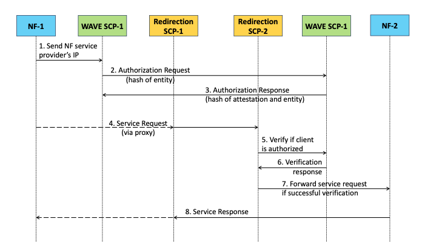

# 5G-WAVE Integrated Platform 

Integration of WAVE with OAI is done by offloading the authorization part onto WAVE-SCPs. A Redirection proxy relays messages between the OAI components and the WAVE-SCP.
A flowchart (temporary) of the message flow is below:



## WAVE-SCP + RedirectionProxy Modification State
The [waveSCPbase](./waveSCPbase) folder contains the necessary files to create a functional demo setup of 3 WAVE-SCP containers, a wave daemon and a wave persistent storage server. Use the respective dockerfiles present in the folder to create docker images for the above stated containers. 
Example commands to create docker images (build context is waveSCPbase folder): 
1.	`docker build -f waveSCPDockerfile -t <username>/wavescp:v4.0 .`
2.	`docker push <username>/wavescp:v4.0`
  
Edit the [deployment](./waveSCPbase/deployment/04_deployment.yaml) config file to use your docker image for the container. 

###  Integration of Redirection Proxy and OAI with WAVE SCP

Build the executable for the redirection proxy with [PyInstaller](https://pyinstaller.org/en/stable/) tool from inside the folder [RedirectionProxy](./RedirectionProxy) using command `pyinstaller --onefile RedirectionProxy.py`. It creates an executable with the same name as the python script name in the dist folder. Follow similar steps to create the `dummyOAI` executable. Copy these executables into the [waveSCPbase](./waveSCPbase) folder and then create the docker images. This will create a docker container image with wavescp, dummyOAI and RedirectionProxy executables to start their respective HTTP servers. 


### Steps to run the demo:

1.  Build the cluster by following steps 1 and 2 of this [repo](https://github.com/chateauxvt/oai5gcore_scaling). We use [cluster.yaml](./cluster.yaml) as the config file to create a K8 cluster of 11 worker nodes and 2 control nodes. 
2.  From the [deployment](./waveSCPbase/deployment) folder, run the following commands
    - `kubectl create namespace -n oai` To create namespace oai in the created cluster
3.  From the top directory
   
    ```
    $ cd waveSCPbase/deployment
    $ ./deploy.sh
    ```
    It creates the WAVE storage server pod, WAVE daemon pod and the WAVE SCP deployment sequentially. This is important since the WAVE storage server and daemon need to be running before the rest of the deployment. The WAVE storage server uses a persistent volume mounted on an external NFS server to store the WAVE object data such as hashes of entities, attestations, and perspective graphs of each entity. The IP address of the NFS server can be be modified in the WAVE storage server [config](./waveSCPbase/deployment/02_waveps.yaml) file. The WAVE daemon pod runs the waved process which acts as an agent to create WAVE objects on the client pod and store their information on the storage server. Both the WAVE storage server and the WAVE daemon are assigned static IPs using [Multus CNI](https://github.com/k8snetworkplumbingwg/multus-cni). These can be changed in their respective YAML files and those IPs need to be modified in the [wavedDockerfile](./waveSCPbase/wavedDockerfile). 
   
    Sample output:
    ```
    networkattachmentdefinition.k8s.cni.cncf.io/wave-ext-net3 created
    persistentvolume/wave-ps-pv created
    persistentvolumeclaim/wave-ps-pvc created
    pod/wave-persistent-server created
	  Waiting for all pods to be deployed..
    networkattachmentdefinition.k8s.cni.cncf.io/wave-ext-net2 created
    pod/wave-daemon created
	  Waiting for all pods to be deployed...
    persistentvolume/wave-scp-pv created
    persistentvolumeclaim/wave-scp-pvc created
    deployment.apps/wave-scp created
    networkattachmentdefinition.k8s.cni.cncf.io/wave-ext-net1 created
    ```

4.  Once all the pods are running, start the dummyOAI, RedirectionProxy and wavescp processes in any two pods. 
	```
	$ kubectl exec -it wave-scp-7488754c5b-nm8p9 -n oai -- bash
	Defaulted container "wavescp" out of: wavescp, init-wavescp (init)
	root@wave-scp-7488754c5b-nm8p9:~/waveSCP/build# ./RedirectionProxy
	INFO:root:Starting httpd...
	```
	In a second terminal, 
	```
	$ kubectl exec -it wave-scp-7488754c5b-nm8p9 -n oai -- bash
	Defaulted container "wavescp" out of: wavescp, init-wavescp (init)
	root@wave-scp-7488754c5b-nm8p9:~/waveSCP/build# ./wavescp
	[2023-01-30 00:38:18.145] [info] Starting HTTP Server for WAVE-5G SCP
	``` 
	One of the two pods will act as requester VNF (`wave-scp-7488754c5b-nm8p9`) and the other will be authorizer VNF (`wave-scp-6dc7dd5745-7fngf`). 
	
5.	The requester VNF will send a curl request to itself at port 10095 (for wave scp) with the auhorizer VNF's IP address in the request data. The WAVE-SCP sends an authorization request to the authorizer WAVE-SCP along with its entity hash value.
Example curl request format from downstream NF: `curl -X POST http://127.0.0.1:10095/oai/discoverdata -d '1&10.42.2.4&3&10.42.9.3'`. The 1st and 3rd field in request body can be VNF names while the 2nd field has to be request VNF IP and 4th field has to be authorizer VNF IP.
	
	The authorizer VNF creates a WAVE attestation for the request and sends the hash of the attestation to the requester VNF. It also maps the IP address of the requester VNF to the attestation hash for future verification. 
	
6.	Now for the service request, the requester VNF sends a curl request to service provider VNF at port 80 (OAI). The format of this request is defined by OAI specifications. Due to port forwarding in the routing table, anything received from an external client at port 80 will be sent to the reverse proxy first at port 10096. The reverse proxy forwards the IP address of the requester to its own WAVE SCP which checks if the requester VNF is authorized to access services (by IP address mapping to hashes and verifying wave attestation). It sends a response back in form or "yes" or "no" to the reverse proxy which forwards it to OAI. 
7.	If the response received is "yes", reverse proxy sends the original HTTP request from the requester VNF to its OAI server.
	Example curl request from requester VNF: `curl -X POST http://10.42.9.3:80/oai/reqservice -d 'test'`. 


